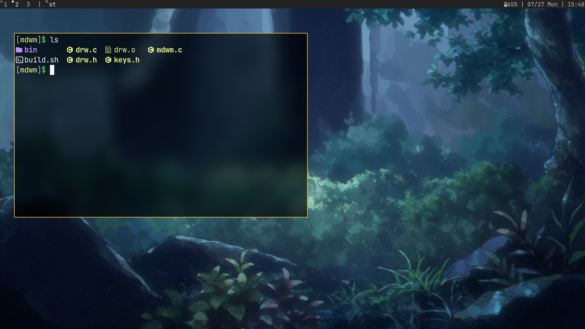

# mdwm



mdwm (mini-dwm) is a personal, stripped-down and optimized fork of suckless dwm that trades optional features and indirection for a smaller codebase, lower memory use, and faster runtime behavior.

IMPORTANT — personal fork

This repository and the changes inside are meant only for my personal use. I do not recommend anyone else use this fork as-is. It intentionally removes features and safety checks to be smaller and faster for my workflow; using it on other systems or expecting it to behave like upstream dwm may lead to missing functionality or surprising behavior.

## Key ideas — smaller & faster
- Fewer data structures and globals: removed unused fields and structs to reduce memory and bookkeeping.
- Single-screen code path: multimonitor/Xinerama support removed and many monitor indirections simplified.
- Removed runtime toggles and dynamic rule matching to reduce branching and event-handling cost.
- Micro-optimizations across the codebase: precalculating layout paddings and bar geometry, inlining small functions, replacing generic LENGTH macros with compile-time _Countof equivalents, moving some heap allocations to globals, and cleaning up stdio usage in the drawing code.
- Simpler build and binary: separated compile/link steps and a small build script that produces a single mdwm binary.

## Notable changes and removed features (from commit history)
The following list summarizes concrete removals and changes observed in the repository commit messages:
- Removed the monocle layout.
- Removed multimonitor support (Xinerama and functions like wintomon, updategeom, updategeom-related indirections).
- Removed the rules/applyrules() machinery (no dynamic rules matching/assignment).
- Removed togglebar() (status bar cannot be toggled at runtime).
- Removed incnmaster() and other rarely-used master-count helpers.
- Removed Button struct and several mouse buttons not used by the author.
- Removed the layout symbol and related layout bookkeeping.
- Stopped grabbing unnecessary keys (unused modifier masks removed) to simplify startup key handling.
- Removed Client.isurgent, `.mon` and other unused Client/Monitor fields — simplified client/monitor structs.
- Removed config.h and utility files (util.c / util.h) in favor of a smaller, more direct configuration in source.
- Replaced LENGTH() macro usages with a safer `_Countof` (and related small macro cleanups).
- Precomputed lrpad, bh, and box widths; precalculated text/layout widths to avoid repetitive computation in draw paths.
- Hardcoded single-screen defines (e.g. `#define screen 0`, `sw`, `sh`) for simplified single-monitor usage.
- Added small patches that the author likes kept: `noborder` and `alwayscenter`.
- Removed Xinerama support and other multi-monitor helpers (clean single-screen code path).
(These items were collected from the repository commit messages and reflect the author's decisions to remove or simplify features.)

## Build / Install

Dependencies:
- Xlib (libX11)
- Xft + fontconfig (libXft, libfontconfig)
- freetype headers (may be required for Xft)
- gcc (C99-capable compiler)

Quick build:
```sh
chmod +x build.sh
./build.sh
# binary will be placed in ./bin/mdwm
```

The included build script compiles drw.c and mdwm.c and links with X11/fontconfig/Xft.

## Configuration
- Keybindings and spawn commands are in `keys.h` (MODKEY is `Mod4Mask` by default). Edit `keys.h` and rebuild to change key mappings.
- Small helper scripts are kept in `bin/` (the repository previously used `scripts/` — see commit history).

## Where to look in the code
- mdwm.c — main window manager logic (entry point, event loop, layout, client management).
- drw.c / drw.h — minimal drawing/text helpers (Xft-based).
- keys.h — keybindings and spawn commands.
- build.sh — simple build script used to compile and place the binary into `bin/`.
